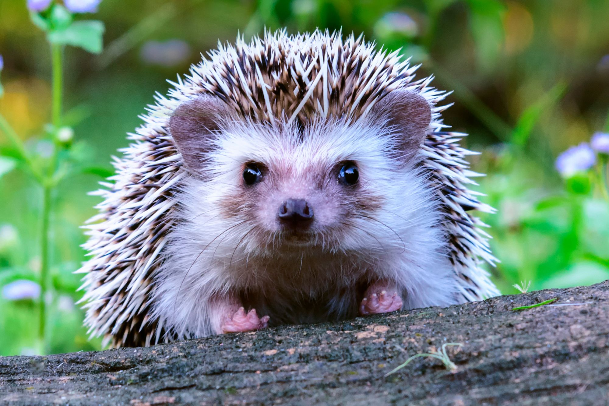

# Приветствую всех! 
## Я – Сёма, очаровательный ёжик! 

Здесь вы узнаете обо мне и моей ёжиной жизни.

---

▎Обо мне, колючем и любопытном

Сёма - очаровательный ёжик

*Я, собственной персоной! Фото прошлой весной.* Сейчас я подрос и стал колючее!

Живу в лесу у березовой рощи. Люблю гулять ночью, шуршать листьями и искать вкусности. Зимой сплю.

Факты обо мне:

•   Имя: Сёма

•   Вид: Ёж обыкновенный

•   Возраст: Молодой и энергичный!

•   Место жительства: Лес у березовой рощи

•   Характер: Любопытный, дружелюбный (но колючий!), немного стеснительный.

---

▎Что я люблю

•   Вкусняшки: Жуков, улиток, червей, ягоды (малину, землянику), яблоки и груши.

•   Ночные прогулки:  В тишине леса все загадочно.

•   Шуршание листьев: Рай для ёжика!

•   Спокойный сон: После ночи – крепкий сон в норке.

---

▎Мои "скиллы"

1.  Обоняние:  Учую жука под землей!

2.  Быстрые лапки:  Бегаю шустро, когда надо.

3.  Маскировка: Сворачиваюсь в колючий клубок – защита!

4.  Любопытство: Помогает узнавать мир!

---

▎Связь

Встретите в лесу – не пугайтесь! Просто наблюдайте издалека. Ёжики занятные!

*Письма не надо, приходите в лес! Может, встретимся!*

---

***

*Вот и всё! Надеюсь, вам было интересно. Заходите ещё!*

*С уважением, ваш колючий друг,*

*Сёма Ёжиков*
